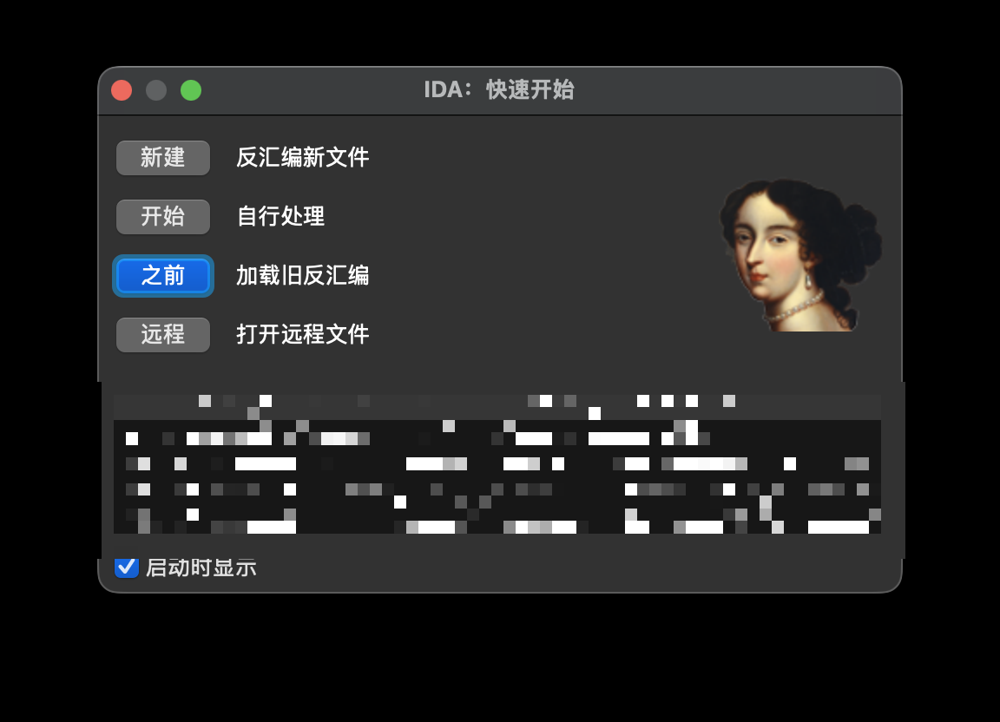
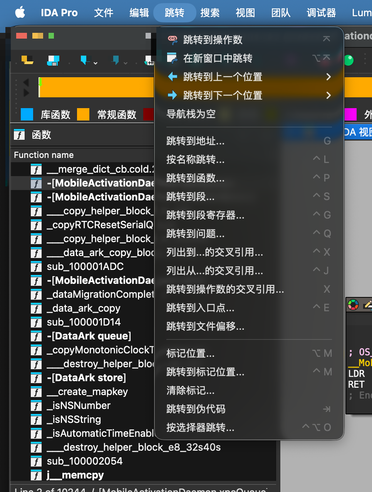
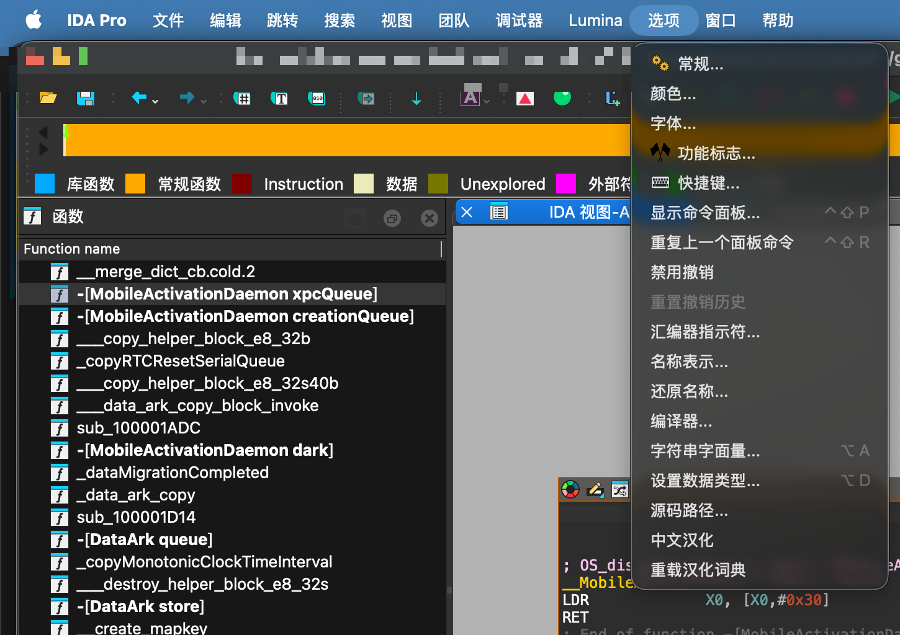
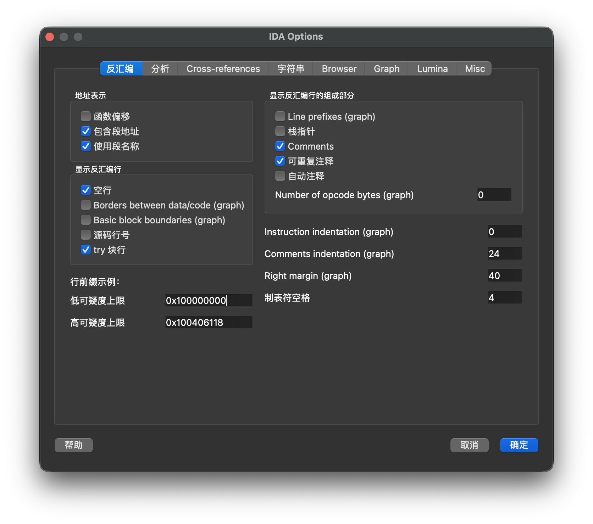

# ida_i18n — IDA Pro 界面汉化插件


在不修改 IDA 任何二进制、不破坏代码签名、不影响功能的前提下，把 IDA Pro 9.x
图形界面上能改的英文文本替换成中文。

> **支持版本：IDA Pro 9.3**（9.0–9.3 通用，已在 9.3.251224 / macOS arm64 测试）。
> 升级到新版本（如 9.4）的适配步骤见 [支持版本与适配新版本](#支持版本与适配新版本)。

- 菜单 / 右键菜单 / 工具栏 / 动作(Action)标签
- 菜单栏标题、对话框标题、按钮、标签、Tab、下拉框

## 效果截图

| 启动窗口 Quick start | 跳转菜单（原本几乎全英文） |
|---|---|
|  |  |

| 主界面 + 选项菜单 | 选项对话框 |
|---|---|
|  |  |

## 原理

| 对象 | 手段 |
|---|---|
| 菜单 / 动作标签 | IDA 官方 Python API：`get_registered_actions` / `get_action_label` / `update_action_label` |
| 菜单栏、菜单项、对话框、控件文本 | Qt 层遍历控件树改文本（PySide6，IDA 自带） |
| 运行时动态弹出的窗口/菜单 | `QApplication` 事件过滤器 + 兜底定时器 |

不写盘、不改 app bundle、不改 `.qm`，纯运行时替换。

启动窗口（Quick start 等在任何数据库加载之前就弹出的对话框）同样覆盖：
插件在 `init` 阶段就安装 Qt 钩子；若此时 QApplication 尚未就绪，则用
IDAPython 定时器轮询重试，装上为止。

## 安装

**一键安装（macOS / Linux）**

```sh
./install.sh
```

**手动安装**

**1) 插件文件**放进 IDA 用户插件目录 `plugins/`：

```
ida_i18n.py
ida_i18n_zh_CN.json
```

- macOS / Linux：`~/.idapro/plugins/`
- Windows：`%APPDATA%\Hex-Rays\IDA Pro\plugins\`

**2) 加载入口**（必须）放进用户目录，与 `plugins/` 同级：

```
idapythonrc.py   ->  ~/.idapro/idapythonrc.py   (Windows: %APPDATA%\Hex-Rays\IDA Pro\idapythonrc.py)
```

这一步是**必需**的：实测 IDA 9.3 对用户 `plugins/` 目录里独立 `.py` 的
自动发现不可靠（有时加载有时完全跳过）。`idapythonrc.py` 是 IDA 每次启动
必定执行的钩子，用它 `import ida_i18n` 才能保证稳定加载。

若你已有 `idapythonrc.py`，只需把这几行追加进去：

```python
import os, sys
sys.path.insert(0, os.path.join(os.path.expanduser("~"), ".idapro", "plugins"))
import ida_i18n
```

重启 IDA。加载成功后，`Options` 菜单下会多出两项：

- **中文汉化** —— 开 / 关切换
- **重载汉化词典** —— 改完 json 后无需重启即可生效

开关状态记在 `ida_i18n.conf.json`（首次自动生成，默认开启）。

## 扩展词典

词典就是「英文原文 → 中文」，直接编辑 `ida_i18n_zh_CN.json`：

```json
{
  "File": "文件",
  "Undo": "撤销",
  "Please wait...": "请稍候..."
}
```

规则：

- 键写英文原文即可。开头的 `&`、两端的 `~`（加速键标记）、结尾的 `...`
  会自动忽略，**不必写出**。
- 值等于键（专有名词）时插件不会改动该文本，保留原有加速键。
- 改完在 IDA 里点 `Options → 重载汉化词典` 即可看到效果。
- `tools/actions_reference.txt` 是 IDA 9.3 导出的全部 action 名称 + 英文标签，
  可据此批量补充。
- `tools/build_actions_dict.py` 重新生成 action 部分译文
  （`python3 tools/build_actions_dict.py`）。
- `tools/build_dialog_dict.py` 重新生成对话框文案部分译文。
- `tools/extract_dialog_strings.py` 从 IDA 主程序重新提取对话框候选文案
  （IDA 升级后可用，只读你本机的 IDA 可执行文件）。
- `tools/dump_actions_reference.py` 在 IDA 里运行，重新导出 action 全表
  （对比新旧版本、只补差异用）。

## 支持版本与适配新版本

插件本身**不绑定具体版本**：它只用 IDA 官方 Python API（action 系统）和
PySide6（Qt 控件树），这两者都相当稳定。所以 IDA 升级后通常**无需改代码**，
需要维护的只是**词典**。适配新版本（例如 9.4）的步骤：

1. **先看是否仍然生效**：升级后启动 IDA，若菜单/对话框已是中文，多半直接可用；
   重点检查 `Options` 菜单里两个开关还在不在（在 = 插件正常加载）。
2. **导出新版本的 action 全表**（看新增/改名的动作）：
   在 IDA 里 `File → Script file...` 运行 `tools/dump_actions_reference.py`，
   它会覆盖 `tools/actions_reference.txt`。然后对比差异：

   ```sh
   git diff tools/actions_reference.txt
   ```

3. **提取新版本的对话框候选文案**：

   ```sh
   python3 tools/extract_dialog_strings.py \
       --binary "/Applications/IDA Professional 9.4.app/Contents/MacOS/ida" \
       --outdir /tmp/ida94
   ```

   （`--binary` 换成新版本的可执行文件路径；Windows 为 `ida.exe`）

4. **只补差异**：把新增/改动的英文按原文补进 `ida_i18n_zh_CN.json`
   （键写英文原文即可，`&`、`~`、结尾 `...` 会自动忽略）。
5. **重新生成词典**（如果批量映射写在生成器里）：
   `python3 tools/build_actions_dict.py` / `python3 tools/build_dialog_dict.py`。
6. **实测**：重启 IDA，或 `Options → 重载汉化词典`，逐项检查。
7. 全好后更新 README 顶部的支持版本与 `CHANGELOG.md`，提交。

需要留意的少数版本相关点：

- 本插件用到的 `ida_kernwin` 接口：`get_registered_actions` / `get_action_label` /
  `update_action_label` / `attach_action_to_menu` / `register_timer`；
- `UI_Hooks` 回调：`ready_to_run` / `updated_actions` / `widget_visible`；
- 若新版本改了菜单栏或对话框的控件结构，只需在 `ida_i18n.py` 的
  `translate_object()` 里补对应的控件类型即可（逻辑很短）。

## 已知限制（设计如此）

词典规模约 1650 条：

- **动作/菜单**：覆盖 IDA 9.3 全部 804 个 action 中的约 650 个（≈81%），
  未覆盖的其余部分是专有名词（Swift / MCP / Python SDK 等）、动态拼接串和纯数字。
- **对话框文案**：从 IDA 主程序静态提取（带 Qt 加速键 `&` 的控件文本、
  表单标签、对话框标题），约 880 条，覆盖 Options 各对话框、各类输入/选择提示等。

- **内核输出窗口(Output)、状态栏、`libida.dylib` 生成的错误/提示串**属于
  编译期内核字符串，本插件无法覆盖。要覆盖只能 patch 二进制（破坏签名、升级即失效，不建议）。
- **chooser 列表的列头**（如 “Function name / Address”）由 IDA 只读模型绘制，
  `setHeaderData` 无效，插件无法修改。
- 词典按精确匹配，IDA 升级导致英文措辞变化时需补词。
- 个别动态菜单标题（如 `DebuggerSelected`）由 IDA 运行时赋值，可能漏翻。

## 项目结构

```
ida_i18n.py                 插件本体
ida_i18n_zh_CN.json         中英词典（约 1650 条）
idapythonrc.py              加载入口（安装到 ~/.idapro/）
install.sh                  一键安装脚本（macOS / Linux）
screenshots/                效果截图
tools/                      词典维护工具
  build_actions_dict.py        action 译文生成器
  build_dialog_dict.py         对话框文案生成器
  extract_dialog_strings.py    从 IDA 主程序提取候选文案
  dump_actions_reference.py    在 IDA 里导出 action 全表（升级适配用）
  actions_reference.txt        IDA 9.3 全部 action 名称 + 英文标签
.github/ISSUE_TEMPLATE/     问题模板（漏翻 / Bug）
CHANGELOG.md                更新日志
LICENSE                     MIT
```

## 卸载

1. 删除 `~/.idapro/plugins/ida_i18n.py`、`ida_i18n_zh_CN.json`、`ida_i18n.conf.json`；
2. 从 `~/.idapro/idapythonrc.py` 里删掉 ida-i18n 那几行
   （或直接删除该文件，若里面没有你其它自定义内容）。

## 贡献

欢迎 PR 补充词典。新增词条直接加进 `ida_i18n_zh_CN.json` 即可；
改完记得在 IDA 里 `Options → 重载汉化词典` 自测，并附一张截图更佳。

## 免责声明

- 本项目与 Hex-Rays SA 无关，非官方项目。**IDA / IDA Pro / Hex-Rays 是
  Hex-Rays SA 的商标**。
- 本仓库**不包含**任何 IDA 程序文件、授权文件或破解内容，仅包含自行编写的
  插件代码与从本机 IDA 界面观察整理的翻译词条。
- 使用本插件需要你自行合法持有 IDA Pro 授权。

## 许可证

[MIT](LICENSE)

